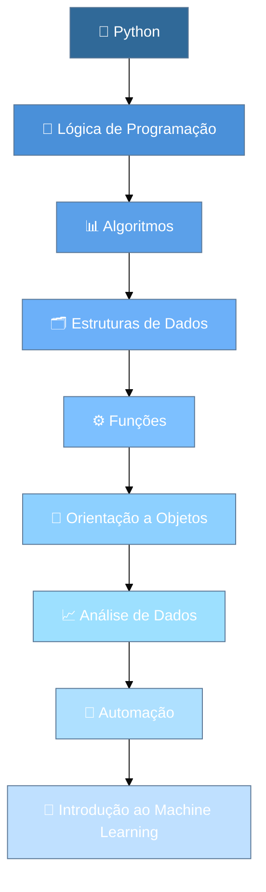

# 🐍 Aula 01 — Introdução aos Algoritmos com Python

# 🎯 Objetivos da Aula

Ao final desta aula, você deverá ser capaz de:

- compreender como a disciplina será organizada;
- entender a importância do Python para Inteligência Artificial;
- conhecer a proposta dos cursos **Python Essentials 1 e Python Essentials 2** da Cisco Networking Academy;
- configurar e utilizar o Python no Visual Studio Code;
- criar e executar arquivos `.py`;
- revisar os principais fundamentos da linguagem Python;
- trabalhar com:
  - `print()`;
  - variáveis;
  - tipos de dados;
  - `input()`;
  - conversão de tipos;
  - operadores;
  - `if`, `elif` e `else`;

- desenvolver um pequeno algoritmo utilizando os conceitos revisados.

---

# 🚀 Bem-vindo à disciplina de Algoritmos em Python

Durante esta Unidade Curricular, nosso objetivo não será apenas aprender comandos da linguagem Python.

Vamos aprender a **resolver problemas utilizando programação**. `Python` será nossa principal ferramenta.

Nossa jornada será aproximadamente assim:



Ao longo da disciplina trabalharemos com diferentes tipos de problemas e projetos.

Entre os conteúdos que veremos estão:

- lógica de programação;
- estruturas condicionais;
- estruturas de repetição;
- listas, tuplas, conjuntos e dicionários;
- funções;
- módulos;
- tratamento de erros;
- manipulação de arquivos;
- orientação a objetos;
- NumPy;
- Pandas;
- Matplotlib;
- RPA;
- introdução ao Machine Learning.

---

# 🧠 Por que Python é tão utilizado em Inteligência Artificial?

Python não é a única linguagem utilizada em Inteligência Artificial.

Entretanto, ela possui um enorme ecossistema de ferramentas voltadas para:

- análise de dados;
- ciência de dados;
- Machine Learning;
- Deep Learning;
- visão computacional;
- automação;
- processamento de linguagem natural.

Algumas bibliotecas que vocês encontrarão ao longo do curso são:

```text
NumPy
Pandas
Matplotlib
Scikit-learn
TensorFlow
PyTorch
OpenCV
```

Não se preocupe caso esses nomes ainda não façam sentido. Eles aparecerão novamente ao longo do curso.

> [!NOTE]
> Antes de construir modelos de Inteligência Artificial, precisamos dominar os fundamentos da programação.
>
> Um modelo de Machine Learning pode ser complexo, mas continua dependendo de variáveis, condições, repetições, funções e estruturas de dados.

É como começar um RPG. Antes de enfrentar o boss final, precisamos aprender os controles básicos. 🎮

---

# 🏅 Cisco Networking Academy — Python Essentials

Durante esta disciplina teremos também a oportunidade de realizar dois cursos da **Cisco Networking Academy — NetAcad**:

## Python Essentials 1

Curso voltado aos fundamentos da linguagem Python.

Entre os principais assuntos estão:

- introdução à programação;
- variáveis;
- tipos de dados;
- operadores;
- entrada e saída;
- condicionais;
- estruturas de repetição;
- listas;
- funções.

---

## Python Essentials 2

O segundo curso avança para conteúdos como:

- módulos;
- pacotes;
- PIP;
- tratamento de exceções;
- strings;
- arquivos;
- programação orientada a objetos;
- herança;
- polimorfismo;
- iteradores;
- generators.

---

## Como funcionará?

Os cursos serão realizados **concomitantemente à nossa disciplina**.

Isso significa que muitos conteúdos estudados nas aulas também aparecerão no `NetAcad`.

```text
Aulas da disciplina
        +
Atividades práticas
        +
Python Essentials 1
        +
Python Essentials 2
        ↓
Conhecimento + prática + badges
```

Em determinados momentos poderemos utilizar parte das aulas para:

- realizar atividades do NetAcad;
- revisar conteúdos;
- resolver laboratórios;
- responder quizzes;
- realizar avaliações.

> [!TIP]
> A ideia não é estudar o mesmo conteúdo duas vezes.
>
> O NetAcad funcionará como uma forma adicional de prática, revisão e certificação dos conhecimentos desenvolvidos durante a disciplina.

### Badges

O `NetAcad` fornece **badges** para os alunos que completam determinados cursos.
Os badges são certificados que podem ser usados para certificar-se de que os alunos conhecem certos conceitos.
Podem ser postados em redes sociais, como o LinkedIn, para fins de certificação, e também no GitHub.

<div align='center'>
    
    
</div>

---

# 🖥️ Preparando nosso ambiente

Até agora vocês tiveram contato com Python utilizando um ambiente simplificado de execução.

A partir desta disciplina utilizaremos uma ferramenta utilizada profissionalmente no desenvolvimento de software:

# Visual Studio Code

O VS Code é um editor de código que permite trabalhar com diversas linguagens e ferramentas.

---

# 🐍 Verificando o Python

Abra o terminal e execute:

```bash
python --version
```

Dependendo da instalação, também pode ser:

```bash
py --version
```

Se o Python estiver instalado corretamente, veremos algo semelhante a:

```text
Python 3.x.x
```

---

# 📁 Criando nosso primeiro projeto

Crie uma pasta chamada:

```text
algoritmos-python
```

Dentro dela, crie um arquivo:

```text
aula01.py
```

Nossa estrutura ficará assim:

```text
algoritmos-python/
└── aula01.py
```

---

# 👋 Nosso primeiro programa

Digite:

```python
print("Olá, mundo!")
```

Execute o programa.

No terminal será apresentado:

```text
Olá, mundo!
```

---

# 🔎 O que aconteceu?

Podemos imaginar o processo da seguinte maneira:

```text
aula01.py
    ↓
Interpretador Python
    ↓
Execução do código
    ↓
Resultado no terminal
```

O VS Code é o ambiente onde escrevemos nosso código.

Quem realmente interpreta e executa o arquivo é o **Python**.

---

# 🖨️ Revisando `print()`

A função `print()` permite mostrar informações no terminal.

Exemplo:

```python
print("Bem-vindo ao Técnico em Inteligência Artificial!")
```

Também podemos imprimir números:

```python
print(10)
print(25.5)
```

Ou realizar operações:

```python
print(10 + 5)
```

Resultado:

```text
15
```

---

# 📦 Variáveis

Variáveis permitem armazenar informações durante a execução do programa.

Exemplo:

```python
nome = "Aragorn"
idade = 87
altura = 1.98
rei = True
```

Podemos imaginar uma variável como uma **caixa que possui um nome e guarda um valor**.

```text
nome
┌─────────────┐
│ "Aragorn"   │
└─────────────┘
```

Depois podemos utilizar esse valor:

```python
nome = "Aragorn"

print(nome)
```

Resultado:

```text
Aragorn
```

---

# 🧬 Tipos de dados

Em Python encontramos diferentes tipos de valores.

## String — `str`

Representa textos.

```python
nome = "Gandalf"
```

---

## Integer — `int`

Representa números inteiros.

```python
idade = 3019
```

---

## Float — `float`

Representa números com casas decimais.

```python
altura = 1.75
```

---

## Boolean — `bool`

Representa verdadeiro ou falso.

```python
ativo = True
```

ou:

```python
ativo = False
```

---

# 🔍 Descobrindo o tipo de uma variável

Podemos utilizar:

```python
type()
```

Exemplo:

```python
nome = "Frodo"
idade = 50

print(type(nome))
print(type(idade))
```

Resultado aproximado:

```text
<class 'str'>
<class 'int'>
```

---

# ⌨️ Entrada de dados com `input()`

Até agora nossos valores estavam escritos diretamente no código.

Mas podemos permitir que o usuário informe os dados.

Utilizamos:

```python
input()
```

Exemplo:

```python
nome = input("Digite seu nome: ")

print(nome)
```

Podemos deixar a mensagem mais interessante:

```python
nome = input("Digite seu nome: ")

print(f"Olá, {nome}!")
```

---

# 🧵 F-Strings

O Python permite inserir valores dentro de textos utilizando **f-strings**.

Exemplo:

```python
nome = "Legolas"
idade = 2931

print(f"{nome} possui {idade} anos.")
```

Resultado:

```text
Legolas possui 2931 anos.
```

As f-strings serão muito utilizadas durante a disciplina.

---

# ⚠️ Uma pegadinha do `input()`

Observe:

```python
idade = input("Digite sua idade: ")

print(idade + 1)
```

Mesmo que o usuário digite:

```text
20
```

o programa apresentará erro.

Por quê?

Porque o `input()` retorna o valor como **texto**.

Ou seja:

```python
idade = "20"
```

e não:

```python
idade = 20
```

---

# 🔄 Conversão de tipos

Podemos converter o valor utilizando:

```python
int()
```

Exemplo:

```python
idade = int(input("Digite sua idade: "))

print(idade + 1)
```

Agora funciona.

Também podemos utilizar:

```python
float()
str()
bool()
```

---

# ➕ Operadores aritméticos

Python permite realizar operações matemáticas.

| Operador | Operação         |
| -------- | ---------------- |
| `+`      | Adição           |
| `-`      | Subtração        |
| `*`      | Multiplicação    |
| `/`      | Divisão          |
| `//`     | Divisão inteira  |
| `%`      | Resto da divisão |
| `**`     | Potenciação      |

Exemplos:

```python
print(10 + 5)
print(10 - 5)
print(10 * 5)
print(10 / 5)
```

---

# 🧮 Operador módulo `%`

O operador `%` retorna o resto de uma divisão.

Exemplo:

```python
print(10 % 2)
```

Resultado:

```text
0
```

Isso permite descobrir, por exemplo, se um número é par.

```python
numero = 10

print(numero % 2)
```

Se o resultado for `0`, o número é divisível por `2`.

---

# ⚖️ Operadores relacionais

Utilizamos operadores relacionais para realizar comparações.

| Operador | Significado    |
| -------- | -------------- |
| `>`      | Maior que      |
| `<`      | Menor que      |
| `>=`     | Maior ou igual |
| `<=`     | Menor ou igual |
| `==`     | Igual          |
| `!=`     | Diferente      |

Exemplo:

```python
idade = 20

print(idade >= 18)
```

Resultado:

```text
True
```

---

# 🧠 Estruturas condicionais

Um programa nem sempre executa exatamente o mesmo caminho.

Às vezes precisamos tomar decisões.

Imagine uma regra:

```text
SE a idade for maior ou igual a 18
    permitir acesso
SENÃO
    negar acesso
```

Em Python:

```python
idade = int(input("Digite sua idade: "))

if idade >= 18:
    print("Acesso permitido")
else:
    print("Acesso negado")
```

---

# ⚠️ Indentação

Observe:

```python
if idade >= 18:
    print("Acesso permitido")
```

O espaço antes do `print()` é chamado de **indentação**.

Em Python a indentação possui significado.

Isso está correto:

```python
if idade >= 18:
    print("Maior de idade")
```

Isso está incorreto:

```python
if idade >= 18:
print("Maior de idade")
```

> [!IMPORTANT]
> Diferente de algumas linguagens que utilizam `{ }`, Python utiliza indentação para identificar blocos de código.

---

# 🔀 Utilizando `elif`

Imagine um sistema de notas:

```text
Nota >= 7
    Aprovado

Nota >= 5
    Recuperação

Caso contrário
    Reprovado
```

Em Python:

```python
nota = float(input("Digite sua nota: "))

if nota >= 7:
    print("Aprovado")
elif nota >= 5:
    print("Recuperação")
else:
    print("Reprovado")
```

---

# 🔗 Operadores lógicos

Também podemos combinar condições.

## `and`

Todas as condições precisam ser verdadeiras.

```python
idade = 20
possui_ingresso = True

if idade >= 18 and possui_ingresso:
    print("Entrada permitida")
```

---

## `or`

Pelo menos uma condição precisa ser verdadeira.

```python
dia = "sábado"

if dia == "sábado" or dia == "domingo":
    print("Final de semana")
```

---

## `not`

Inverte um valor lógico.

```python
logado = False

if not logado:
    print("Usuário precisa fazer login")
```

---

# 🧪 Exemplo completo

Vamos desenvolver um pequeno sistema de personagem.

```python
nome = input("Digite o nome do personagem: ")
idade = int(input("Digite a idade do personagem: "))

if idade >= 18:
    print(f"{nome} está preparado para a aventura!")
else:
    print(f"{nome} ainda não pode participar da missão.")
```

---

# ⚔️ Desafio — Entrada na Sociedade do Anel

Agora é sua vez.

Desenvolva um programa que determine se um personagem está preparado para participar de uma missão.

O programa deverá solicitar:

```text
Nome do personagem
Idade
Possui arma? S/N
```

---

## Regras

### Regra 1

Se o personagem possuir menos de 16 anos:

```text
Você ainda não pode participar da missão.
```

---

### Regra 2

Se possuir 16 anos ou mais, mas não possuir arma:

```text
Você poderá participar, mas precisa receber equipamento.
```

---

### Regra 3

Se possuir 16 anos ou mais e possuir uma arma:

```text
Você está pronto para a missão!
```

---

## Exemplo de execução

```text
Digite seu nome: Legolas
Digite sua idade: 2931
Possui arma? S

Bem-vindo, Legolas!
Você está pronto para a missão!
```

---

# 💡 Dica

Você poderá precisar utilizar:

```python
input()
int()
if
elif
else
```

Também poderá comparar textos:

```python
arma == "S"
```

---

# ⭐ Desafio Extra

Terminou o exercício principal?

Adicione a classe do personagem.

O programa deverá perguntar:

```text
Escolha sua classe:

1 - Guerreiro
2 - Mago
3 - Arqueiro
```

Depois apresente uma mensagem diferente para cada classe.

Exemplo:

```text
Guerreiro:
Prepare sua espada!

Mago:
Não esqueça seu cajado!

Arqueiro:
Confira suas flechas!
```

---

# 🧠 Pense antes de programar

Antes de escrever código, tente definir o algoritmo.

Exemplo:

```text
INÍCIO

Ler nome
Ler idade
Ler se possui arma

SE idade < 16
    Mostrar mensagem

SENÃO SE não possui arma
    Mostrar mensagem

SENÃO
    Mostrar mensagem

FIM
```

> [!TIP]
> Programar não significa começar digitando código.
>
> Primeiro entendemos o problema.
>
> Depois pensamos em uma solução.
>
> Só então transformamos essa solução em código.

---

# 🗺️ Onde estamos?

Hoje estamos aqui:

```text
Fundamentos
    ↓
Lógica de Programação
    ↓
Estruturas Condicionais
    ↓
Estruturas de Repetição
    ↓
Estruturas de Dados
    ↓
Funções
    ↓
Orientação a Objetos
    ↓
Análise de Dados
    ↓
Automação
    ↓
Machine Learning
```

Ainda estamos no início da jornada.

Mas praticamente tudo que construiremos nas próximas aulas utilizará os conceitos vistos hoje.

---

# ✅ Checklist da Aula

Ao finalizar a aula, verifique se você consegue:

- [ ] criar um arquivo `.py`;
- [ ] executar um programa Python;
- [ ] utilizar `print()`;
- [ ] criar variáveis;
- [ ] identificar `str`, `int`, `float` e `bool`;
- [ ] utilizar `input()`;
- [ ] converter valores com `int()` e `float()`;
- [ ] utilizar operadores matemáticos;
- [ ] realizar comparações;
- [ ] construir condições com `if`;
- [ ] utilizar `elif`;
- [ ] utilizar `else`;
- [ ] entender a importância da indentação;
- [ ] desenvolver um algoritmo simples.
